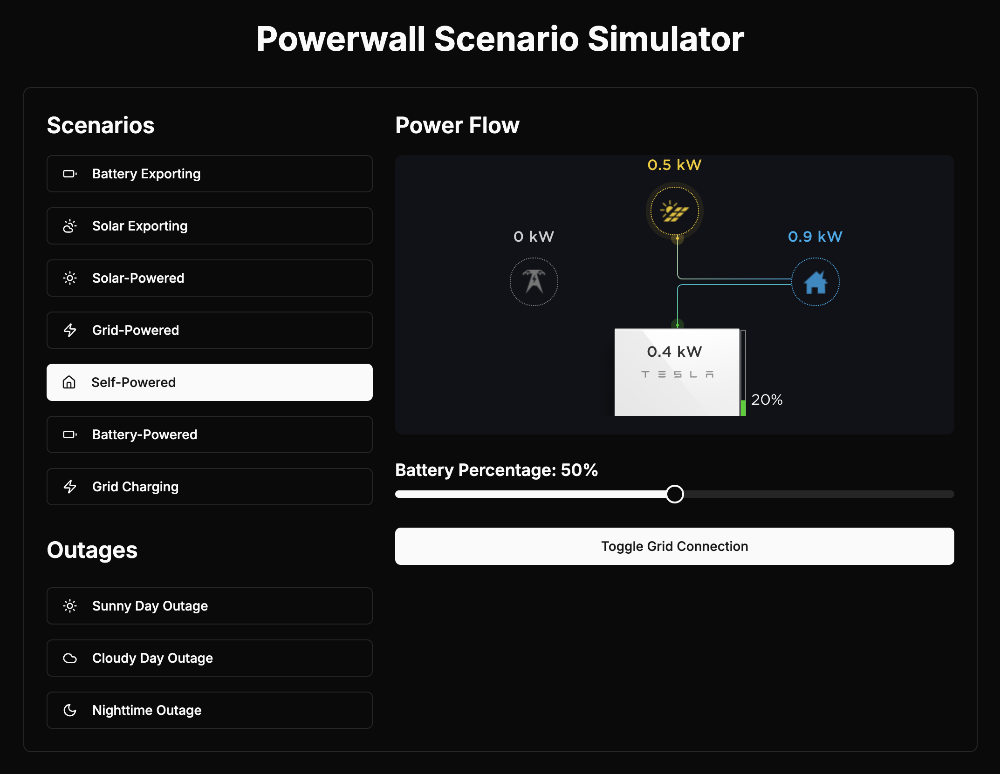

# pypowerwall Simulator Control

An interface to control the [pypowerwall simulator](https://github.com/jasonacox/pypowerwall/tree/main/pwsimulator), to make it easier to diagnose/debug/build against simulated scenarios.



## Running

To run, make sure you have pypowerwall running, run the following command, and then open [http://locahost:3000](http://localhost:3000).
```sh
docker run --rm -p 3000:3000 mccahan/pypowerwall-simulator-control:latest
```
